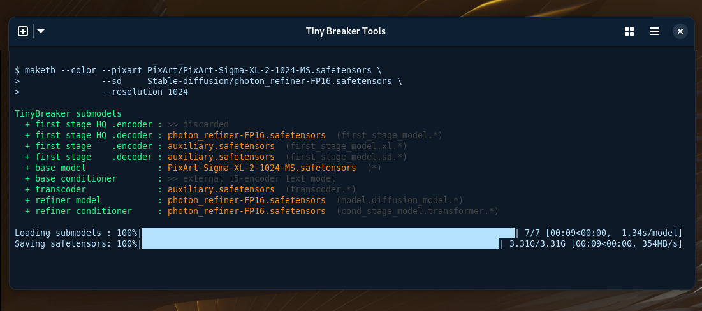

<div align="center">

# Tiny Breaker Tools

<p>


</p>

<!-- Image -->

</div>

`maketb` is a command-line tool designed to create TinyBreaker models. These models combine the strengths of a PixArt model with a refiner model (either SD1.5 or SDXL) to generate high-quality images.


## Overview

TinyBreaker models are built by merging a pre-trained PixArt model with a refiner model. This combination allows for efficient and effective image generation, leveraging the strengths of both architectures. The `maketb` tool simplifies this process, allowing users to create their custom TinyBreaker models by specifying the desired models and parameters.


## Features

 - **Support PixArt model resolutions:** Allows you to integrate pixart models of different resolutions 512px, 1024px, 2048px
 - **Flexible Refiner Selection:** Supports both SD1.5 and SDXL refiner models.
 - **Simple Command-Line Interface:** Easy to use with clear command-line arguments.


## Installation

Currently, `maketb` is a command-line tool and does not require installation via pip. Simply clone the repository and ensure you have the required dependencies (e.g., PyTorch, Transformers, etc.) installed.

```bash
  git clone https://github.com/martin-rizzo/TinyBreakerTool
  cd TinyBreakerTool
  # create the python virtual environment with the dependencies of the project
  ./maketb.sh --create-venv
```


## Command "maketb"

The `maketb` command takes several arguments to create a TinyBreaker model. Here's how to use it:

### SD1.5 as Refiner

```maketb --pixart <pixart-model> --sd <sd_model> --resolution <pixart-resolution>```

-   `--pixart <pixart-model>`: Specifies the path to the PixArt model in safetensors format.
-   `--sd <sd_model>`: Specifies the path to the SD1.5 refiner model in safetensors format.
-   `--resolution <resolution>`: Declares the resolution for which the PixArt model was trained (e.g., 1024).

### SDXL as Refiner

```maketb --pixart <pixart-model>  --sdxl <sdxl_model> --resolution <pixart-resolution>```

-   `--pixart <pixart-model>`: Specifies the path to the PixArt model in safetensors format.
-   `--sdxl <sdxl_model>`: Specifies the path to the SDXL refiner model in safetensors format.
-   `--resolution <resolution>`: Declares the resolution for which the PixArt model was trained (e.g., 1024).

### Example

```bash
./maketb.sh --pixart pixart-alpha-base.safetensors \
       --sdxl sdxl-base-1.0.safetensors \
       --aux auxiliary.safetensors \
       --resolution 1024
```

This command will create a TinyBreaker model using `pixart-alpha-base.safetensors` as the PixArt main model, `sdxl-base-1.0.safetensors` as the SDXL refiner, and the provided `auxiliary.safetensors` as the auxiliary models, declaring a resolution of 1024px for the PixArt model.

To know more parameters, use `./maketb.sh --help`.


## Support Models

The `auxiliary.safetensors` file is crucial for the proper functioning of TinyBreaker models. This file contains pre-trained support models that are necessary for the merging process. **This file is already included in the repository.**


## License

Copyright (c) 2025 Martin Rizzo  
This project is licensed under the MIT license.  
See the ["LICENSE"](LICENSE) file for details.


